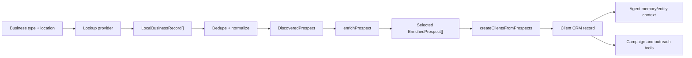

# Client CRM Local Prospecting Design

Last updated: 2026-04-29

## Purpose

The Clients CRM is the seedbed for local automation campaigns. The best use is:

1. Define a local target market, such as "law firms in Milwaukee" or "pool builders near Madison".
2. Bulk look up companies by business type and location.
3. Normalize each listing into a complete Client prospect record with company name, website, phone, location, services, confidence, contact path, automation fit, recommended skills, recommended workflows, and portal-ready messaging.
4. Import the best prospects into the CRM.
5. Let the business agent use those client records as entities for outreach briefs, email drafts, work plans, and recurring campaign execution.

The current build already has the most important downstream CRM pieces. The missing piece was a provider-backed lookup intake that feeds the existing enrichment and import path.

## Current Application State

Existing CRM capabilities:

- `components/ClientManagementPanel.tsx` manages prospects, outreach status, contacts, selected skills/workflows, portal messaging, notes, and basic CRUD.
- `components/ProspectingPanel.tsx` supports industry/location/search-query input, manual pasted result parsing, enrichment, selection, and bulk import.
- `components/ClientImportExportPanel.tsx` supports CSV import/export.
- `lib/clients.ts` stores Clients in Supabase when configured and falls back to localStorage.
- `lib/prospecting.ts` parses web results, detects industry, enriches prospects with pain points, estimated savings, recommended skills/workflows, and creates Client records.
- Client records already support company metadata, website, description, services, location, priority, LinkedIn, estimated time/cost savings, pain points, key use cases, contacts, selected skills/workflows, custom portal messaging, status, and notes.

Gaps found:

- Prospect discovery was manual-only; the Search button only opened the paste-results path.
- Local lookup providers were not abstracted behind a typed normalized record.
- The UI did not distinguish demo/manual lookup from production provider lookup.
- Imported contact quality was uneven because local directory APIs usually provide business phone and website, not named decision makers or email.
- There was no campaign-fit score to quickly identify which prospects are worth outreach first.
- The agentic ToolCapability registry did not yet expose CRM prospecting as composable agent tools.

## Provider Research

Google Places API is the best first production provider for company lookup because Text Search accepts natural language queries like a category plus location and returns Place objects. The new Text Search endpoint is a POST to `https://places.googleapis.com/v1/places:searchText`; it requires `textQuery` and a field mask. Google explicitly recommends field masks to control response size and billing. Relevant fields include `places.id`, `places.displayName`, `places.formattedAddress`, `places.location`, `places.types`, `places.googleMapsUri`, `places.nationalPhoneNumber`, `places.internationalPhoneNumber`, `places.websiteUri`, `places.rating`, and `places.userRatingCount`. Source: https://developers.google.com/maps/documentation/places/web-service/text-search

Google Place Details can be added later when Text Search is run in a lower-cost field mask first and details are fetched only for selected candidates. Place Details also requires a field mask and can return more comprehensive data for a place ID. Source: https://developers.google.com/maps/documentation/places/web-service/place-details

Google's data-fields documentation shows phone, website, rating, and review count are higher-cost data fields, so the product should make lookup cost visible and avoid wildcard field masks in production. Source: https://developers.google.com/maps/documentation/places/web-service/data-fields

Yelp Places API is a reasonable second provider for local recommendations and business details, but it is a paid data-licensing product and uses private-key authentication. It is useful as a quality cross-check, not the first default. Source: https://docs.developer.yelp.com/docs/places-intro

OpenStreetMap Nominatim is not a good default for bulk prospecting. Its public service has limited capacity, asks for a maximum of 1 request per second, discourages bulk geocoding, and forbids systematic POI harvesting. Source: https://operations.osmfoundation.org/policies/nominatim/

Important constraint: local directory APIs rarely provide named decision makers or direct email. The CRM should not invent emails. It should import a "Main Office" contact when phone is available, then use a separate enrichment step to inspect the company website contact page, LinkedIn/company pages, or a licensed people-data provider.

## Implemented Update

New code:

- `lib/localBusinessLookup.ts`
  - `lookupLocalBusinesses(query)`
  - `googlePlaceToLocalBusinessRecord(place)`
  - `googlePlacesToLocalBusinessRecords(places)`
  - `dedupeLocalBusinessRecords(records)`
  - `localBusinessRecordToDiscoveredProspect(record)`
  - `localBusinessRecordsToEnrichedProspects(records)`
  - `assessAutomationCampaignFit(input)`
  - `buildClientProspectImportPreview(prospects, clients)`
- `supabase/functions/local-business-lookup/index.ts`
  - Secure Google Places proxy using server-side `GOOGLE_PLACES_API_KEY`.
  - Requires authenticated Supabase requests.
  - Uses a production field mask instead of wildcard fields.
- `lib/crmAgentTools.ts`
  - Executable CRM capability dispatcher.
  - Website contact extraction from fetched or provided HTML.
  - Local campaign worklist builder.
  - Local automation outreach draft renderer.
- `components/ProspectingPanel.tsx`
  - Lookup source selector: demo lookup, Supabase Places proxy, direct Google Places.
  - Business type, location, max results, optional min rating.
  - Direct API key input only for local development.
  - Campaign fit score on prospect cards.
  - Duplicate import preview against existing Clients by provider ID, website domain, phone, and company name.
  - Import continues through the existing enriched Client creation path.
- `supabase/migrations/20260429_client_lookup_provenance.sql`
  - Adds `source_provider`, `source_external_id`, `source_url`, `lookup_confidence`, and `lookup_raw` to `public.clients`.
- `lib/agentic/runner.ts`
  - Executes supported CRM internal/renderer capabilities directly inside DAG runs without forcing deterministic work through an LLM skill.
- `docs/AGENTIC_BUSINESS_AGENT_DESIGN_UPDATE.md`
  - Current readout of how CRM prospecting fits the broader business-agent architecture.
- `NEXT_INSTALL_STEPS.md`
  - Prioritized deployment checklist for SQL, Edge Function, secrets, and hosted smoke tests.

## Current Live Boundary

Live in the repository and covered by tests:

- Local lookup normalization, provider mapping, dedupe, and campaign-fit scoring.
- Duplicate-aware import preview by provider id, website/domain, phone, and company name.
- First-class Client provenance fields in TypeScript storage and Supabase mapping.
- Agentic ToolCapabilities for CRM lookup, enrichment, scoring, contact extraction, import, outreach drafting, and campaign worklist building.
- Runner support for executing supported CRM tools directly as internal/renderer capabilities.
- Goal planner recognition of local prospecting goals.

Not live in hosted production until installed:

- `agentic.skill_executions` routing/cost columns.
- `agentic.quality_events`.
- `public.clients` lookup provenance columns.
- `local-business-lookup` Supabase Edge Function.
- `GOOGLE_PLACES_API_KEY` Supabase secret.
- `agentic` schema exposure in Supabase API/PostgREST.

The exact install checklist is maintained in `NEXT_INSTALL_STEPS.md`.

## Data Flow

## Client Record Mapping

Lookup field to Client field:

- `companyName` -> `Client.companyName`
- `website` -> `Client.website`
- `description` -> `Client.description`
- `formattedAddress` -> `Client.location`
- `categories` -> `Client.services`
- detected industry -> `Client.industry`
- generated company type -> `Client.companyType`
- estimated savings -> `Client.estimatedTimeSavings`, `Client.estimatedCostSavings`
- industry pain points -> `Client.painPoints`, `Client.keyUseCases`
- recommended skills/workflows -> `Client.selectedSkillIds`, `Client.selectedWorkflowIds`
- phone/contact path -> `Client.contacts[0]` as "Main Office" when no named person exists
- source and confidence -> `Client.notes`
- lookup provenance -> `Client.sourceProvider`, `Client.sourceExternalId`, `Client.sourceUrl`, `Client.lookupConfidence`, `Client.lookupRaw`

Do not fabricate missing emails. Email should come from a website-contact extraction capability, a direct user edit, or a licensed enrichment provider.

## Agentic Capability Design

The CRM should not be just a UI page. It should expose small, typed tools the business agent can compose:

- `crm.find-local-businesses`
  - Input: business type, location, max results, rating filters.
  - Output: normalized local business records.
  - Side effect: external-read.
- `crm.enrich-local-prospects`
  - Input: local business records.
  - Output: enriched prospects with pain points, use cases, savings, recommended skills/workflows.
  - Side effect: none.
- `crm.import-client-prospects`
  - Input: approved enriched prospects.
  - Output: created Client IDs and import summary.
  - Side effect: database-write.
- `crm.score-automation-campaign-fit`
  - Input: prospect or local business record.
  - Output: score, reasons, missing data, recommended angle.
  - Side effect: none.
- `crm.draft-local-automation-outreach`
  - Input: Client prospect, selected automation angle, proof points.
  - Output: email, LinkedIn note, call opener.
  - Side effect: none.
- `crm.build-local-campaign-worklist`
  - Input: selected prospects and campaign goal.
  - Output: prioritized outreach plan.
  - Side effect: none.
- `crm.extract-website-contact-info`
  - Input: website URL or provided HTML.
  - Output: public emails, phone numbers, contact/about/team URLs, leadership names, confidence.
  - Side effect: external-read when fetching.

These capabilities let a future goal such as "Find 40 local law firms around Milwaukee and draft a two-week automation outreach campaign" become a dynamic DAG:

1. Find local businesses.
2. Score fit.
3. Enrich selected prospects.
4. Import approved prospects.
5. Draft campaign worklist.
6. Draft outreach.
7. Persist facts.
8. Queue side-effect approvals only when sending or task creation is requested.

## Error Handling

Lookup errors should be explicit and recoverable:

- Missing business type -> block lookup with validation.
- Supabase not configured -> show user to use demo lookup or configure Supabase.
- Missing `GOOGLE_PLACES_API_KEY` in the Edge Function -> return 503.
- Provider rate limit/API failure -> return provider status and a short message.
- Empty results -> keep the user in the lookup form and suggest broader business type/location.
- Missing contact email -> import with phone/website only and mark contact as "Main Office"; do not invent data.
- Duplicates -> dedupe by provider external ID, then normalized company name + address.

## Security and Compliance

- Production provider keys belong in Supabase Edge Functions, not browser storage.
- Direct Google Places mode is for local development only.
- Store provider, external id, source URL, confidence, and raw normalized payload in dedicated provenance fields when the migration is installed.
- Before sending outreach, enforce CAN-SPAM style basics: real sender identity, truthful subject, physical address, unsubscribe/opt-out handling, and suppression list checks.
- Phone/SMS outreach should not proceed without explicit compliance handling for consent and local rules.

## Roadmap

Immediate:

- Done: add CRM prospecting ToolCapabilities to `lib/agentic/toolRegistry.ts`.
- Done: add tests for local lookup normalization, dedupe, prospect enrichment, campaign scoring, capability search, CRM capability execution, and DAG runner execution.
- Done: add CRM coverage rows to the capability dashboard by including ready CRM capabilities.
- Done: persist lookup provenance with first-class fields.
- Done: add selected-prospect import preview with duplicate detection.
- Done: add website contact extraction capability.
- Done: add campaign list builder capability.

Next:

- Add server-side website contact extraction Edge Function so production contact extraction avoids browser CORS limits and can enforce robots/rate limits.
- Add duplicate review controls that let the user merge, skip, or import as separate branch/location.
- Add CRM campaign entity tables for campaign, campaign_member, outreach_step, and suppression list.
- Add connector-backed task/email draft creation from campaign worklists, still behind approval for side effects.
- Add "deliverable renderer" for local automation campaign briefs.

Later:

- Add Yelp as a second licensed provider.
- Add business website crawl/contact enrichment through a server-side connector with robots/rate-limit controls.
- Add Apollo/People Data Labs/Clearbit style people enrichment only if licensed and compliant.
- Add task/email/calendar connectors behind approvals so the agent can create campaign worklists, draft emails, schedule follow-ups, and eventually send approved outreach.
